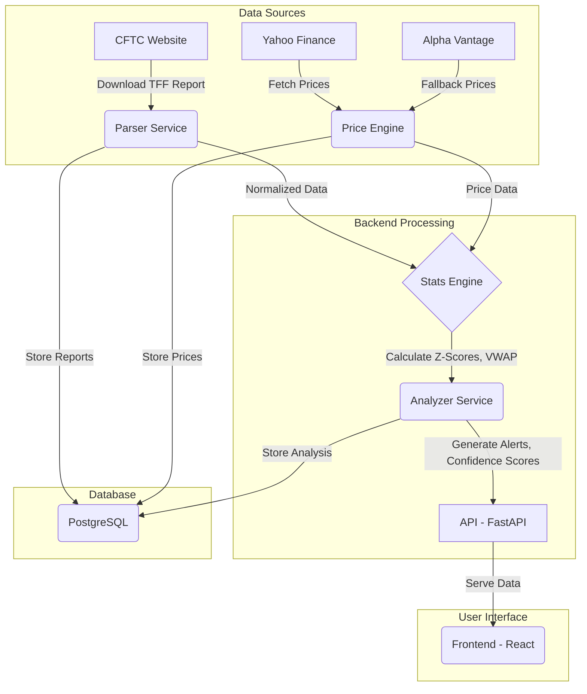

# WhaleRadarr v3.0

**Advanced Institutional Positioning Tracking Platform for Financial Futures**

WhaleRadarr is an analytical platform designed to process the CFTC's **Commitments of Traders (COT)** reports, with the goal of identifying and interpreting significant changes in the positioning of institutional operators (the "Whales").

The platform is based on a robust statistical approach and a contextual analysis of price to provide clear signals, cleaned from market "noise" such as futures contract rollovers.

## ✨ Key Features

- **Robust Statistical Analysis**: Use of **Robust Z-scores** (based on Median and IQR) to identify statistically significant deviations, resisting outliers.
- **Real Price Context**: Correlation of positioning changes with the weekly **Volume Weighted Average Price (VWAP)** to determine if positions were accumulated in profit or loss.
- **Intelligent Rollover Management**: Algorithms to recognize and filter false signals generated by the technical expiration of futures contracts.
- **Resilient Data**: Automatic fallback strategy between different data sources (Yahoo Finance, Alpha Vantage) to ensure continuity and reliability.
- **Dual Metrics**: Combined analysis of **Robust Z-score** (for short-term shocks) and **COT Index** (for long-term positioning extremes).
- **Gross Exposure Tracking**: Monitoring of the gross exposure (Long + Short) of Hedge Funds to detect hidden risk increases in delta-neutral strategies.

## 🏗 Architecture and Data Flow

The project is a monorepo with a clear separation between backend, frontend, and infrastructure.



1.  **Ingestion**: TFF (Traders in Financial Futures) reports are downloaded from the CFTC website every Friday.
2.  **Parsing and Normalization**: Data is cleaned, normalized, and enriched. *Gross Exposure* is calculated and rollover rules are applied.
3.  **Price Enrichment**: Historical price and volume data are retrieved to calculate the weekly VWAP.
4.  **Statistical Analysis**: The statistical engine calculates *Robust Z-scores* and the *COT Index* for each operator category.
5.  **Alert Generation**: The analyzer combines positioning, statistical, and price data to generate qualified alerts with a *confidence score*.
6.  **Distribution**: Results are exposed via a RESTful API and displayed on an interactive dashboard.

## 🚀 Getting Started

### Prerequisites

-   **Docker & Docker Compose**: For the containerized environment (recommended choice).
-   **Node.js v18+**: For frontend development.
-   **Python v3.11+**: For backend development.

### Start with Docker (Recommended)

The entire stack (backend, database, accessory services) is managed via Docker Compose.

```bash
# 1. Clone the repository
git clone <repository_url>
cd Whaleradarr_v3

# 2. Start the containers in the background
docker-compose up -d --build
```

At this point, the backend will be accessible at `http://localhost:8000`.

### Running with Antigravity
If you are using Antigravity to run this project, you can simply ask the agent:
> "Run the `/setup` workflow to initialize the database and populate data."

This workflow (located in `.agent/workflows/setup.md`) automates:
1.  Docker infrastructure startup (using Python 3.12 for ARM64 compatibility).
2.  Database schema initialization.
3.  **SQL View Creation** (Crucial for dashboard functionality).
4.  Historical COT data ingestion (2015-2026).
5.  Yahoo Finance price ingestion.
6.  Technical analysis and alert generation.

### Local Development

**Backend:**

```bash
# 1. Navigate to the backend directory
cd backend

# 2. Create and activate a virtual environment
python -m venv .venv
source .venv/bin/activate

# 3. Install dependencies
pip install -r requirements.txt

# 4. Start the development server
uvicorn app.main:app --reload --port 8000
```

**Frontend:**

```bash
# 1. Navigate to the frontend directory
cd frontend

# 2. Install dependencies
npm install

# 3. Start the development server
npm run dev
```

The frontend will be accessible at `http://localhost:5173`.

## 🛠 Technical Stack

-   **Backend**: **Python 3.11**, **FastAPI**, **SQLAlchemy 2.0**, Pydantic.
-   **Database**: **PostgreSQL 14**, **Redis 7**.
-   **Data Analysis**: **Pandas**, **NumPy**, SciPy.
-   **Financial Data Sources**: `yfinance`, `alpha_vantage`.
-   **Frontend**: **React 18**, **Vite**, **TypeScript**, **Tailwind CSS**, Recharts.
-   **Infrastructure**: **Docker**, **Docker Compose**.

## 📈 Project Status (As of Feb 2026)

-   [x] **Core Data Models**: Defined and implemented (Contracts, Reports, Prices).
-   [x] **Data Ingestion**: Loader implemented for CFTC reports (`cot_loader.py`) and for price data (`price_loader.py`).
-   [ ] **Rollover Logic**: Under development.
-   [ ] **Statistical Engine**: Under development.
-   [ ] **Alert Analyzer**: Not started.
-   [ ] **API Endpoints**: Not implemented.
-   [ ] **Frontend Dashboard**: Basic structure created, but not yet connected to the backend.

The current focus is on completing the data analysis logic in the backend.

## 📄 License

This project is proprietary and is not distributed with an open-source license.
