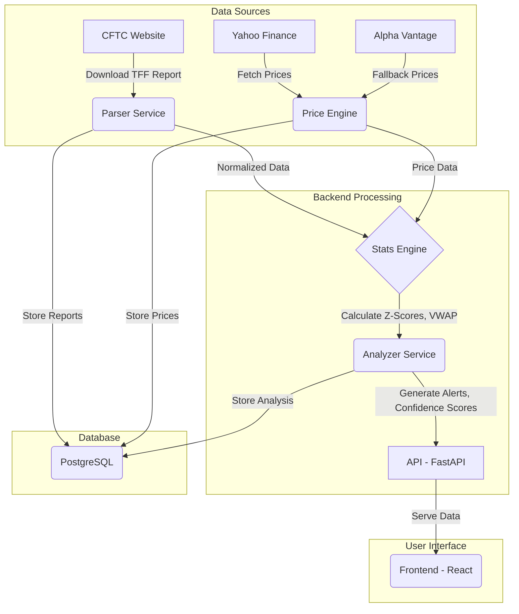

# WhaleRadarr v3.0

**Piattaforma Avanzata di Tracciamento del Posizionamento Istituzionale per Futures Finanziari**

WhaleRadarr è una piattaforma analitica progettata per processare i report **Commitments of Traders (COT)** della CFTC, con l'obiettivo di identificare e interpretare i cambiamenti significativi nel posizionamento degli operatori istituzionali (le "Whales" o "balene").

La piattaforma si basa su un approccio statistico robusto e un'analisi contestuale del prezzo per fornire segnali chiari, puliti dal "rumore" di fondo del mercato, come i rollover dei contratti futures.

## ✨ Key Features

- **Analisi Statistica Robusta**: Utilizzo di **Robust Z-scores** (basati su Mediana e IQR) per identificare deviazioni statisticamente significative, resistendo agli outlier.
- **Contesto di Prezzo Reale**: Correlazione dei cambiamenti di posizionamento con il **Volume Weighted Average Price (VWAP)** settimanale per determinare se le posizioni sono state accumulate in profitto o in perdita.
- **Gestione Intelligente del Rollover**: Algoritmi per riconoscere e filtrare i falsi segnali generati dalla scadenza tecnica dei contratti futures.
- **Dati Resilienti**: Strategia di fallback automatico tra diverse fonti dati (Yahoo Finance, Alpha Vantage) per garantire continuità e affidabilità.
- **Metriche Duali**: Analisi combinata di **Robust Z-score** (per shock a breve termine) e **COT Index** (per estremi di posizionamento a lungo termine).
- **Gross Exposure Tracking**: Monitoraggio dell'esposizione lorda (Long + Short) degli Hedge Fund per rilevare aumenti di rischio nascosti in strategie delta-neutral.

## 🏗 Architettura e Flusso Dati

Il progetto è un monorepo con una chiara separazione tra backend, frontend e infrastruttura.



1.  **Ingestione**: I report TFF (Traders in Financial Futures) vengono scaricati dal sito della CFTC ogni venerdì.
2.  **Parsing e Normalizzazione**: I dati vengono puliti, normalizzati e arricchiti. Viene calcolata la *Gross Exposure* e vengono applicate le regole per il rollover.
3.  **Arricchimento Prezzi**: I dati storici di prezzo e volume vengono recuperati per calcolare il VWAP settimanale.
4.  **Analisi Statistica**: Il motore statistico calcola i *Robust Z-scores* e il *COT Index* per ogni categoria di operatore.
5.  **Generazione Alert**: L'analyzer combina i dati di posizionamento, statistici e di prezzo per generare alert qualificati con un *confidence score*.
6.  **Distribuzione**: I risultati sono esposti tramite un'API RESTful e visualizzati su una dashboard interattiva.

## 🚀 Getting Started

### Prerequisiti

-   **Docker & Docker Compose**: Per l'ambiente containerizzato (scelta raccomandata).
-   **Node.js v18+**: Per lo sviluppo del frontend.
-   **Python v3.11+**: Per lo sviluppo del backend.

### Avvio con Docker (Raccomandato)

L'intero stack (backend, database, servizi accessori) è gestito tramite Docker Compose.

```bash
# 1. Clona il repository
git clone <repository_url>
cd Whaleradarr_v3

# 2. Avvia i container in background
docker-compose up -d --build
```

A questo punto, il backend sarà accessibile su `http://localhost:8000`.

### Sviluppo Locale

**Backend:**

```bash
# 1. Naviga nella directory del backend
cd backend

# 2. Crea e attiva un ambiente virtuale
python -m venv .venv
source .venv/bin/activate

# 3. Installa le dipendenze
pip install -r requirements.txt

# 4. Avvia il server di sviluppo
uvicorn app.main:app --reload --port 8000
```

**Frontend:**

```bash
# 1. Naviga nella directory del frontend
cd frontend

# 2. Installa le dipendenze
npm install

# 3. Avvia il server di sviluppo
npm run dev
```

Il frontend sarà accessibile su `http://localhost:5173`.

## 🛠 Stack Tecnico

-   **Backend**: **Python 3.11**, **FastAPI**, **SQLAlchemy 2.0**, Pydantic.
-   **Database**: **PostgreSQL 14**, **Redis 7**.
-   **Analisi Dati**: **Pandas**, **NumPy**, SciPy.
-   **Fonti Dati Finanziari**: `yfinance`, `alpha_vantage`.
-   **Frontend**: **React 18**, **Vite**, **TypeScript**, **Tailwind CSS**, Recharts.
-   **Infrastruttura**: **Docker**, **Docker Compose**.

## 📈 Project Status (As of Feb 2026)

-   [x] **Core Data Models**: Definiti e implementati (Contratti, Report, Prezzi).
-   [x] **Data Ingestion**: Implementati i loader per i report CFTC (`cot_loader.py`) e per i dati di prezzo (`price_loader.py`).
-   [ ] **Rollover Logic**: In fase di sviluppo.
-   [ ] **Statistical Engine**: In fase di sviluppo.
-   [ ] **Alert Analyzer**: Non iniziato.
-   [ ] **API Endpoints**: Non implementati.
-   [ ] **Frontend Dashboard**: Struttura di base creata, ma non ancora collegata al backend.

Il focus attuale è sul completamento della logica di analisi dei dati nel backend.

## 📄 License

Questo progetto è proprietario e non è distribuito con una licenza open-source.
